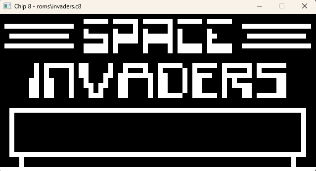

# gochip8

[CHIP-8](https://en.wikipedia.org/wiki/CHIP-8) emulator written in Go



## Dependencies

Used a [SDL2 Wrapper for Go](https://github.com/veandco/go-sdl2)

```
go get -u github.com/veandco/go-sdl2/sdl
```

## Prerequisites

Must download SDL2 Library for your os platform, which is included in the go-sdl2 documentation

## Usage

```
go run main.go <path-to-ch8-rom>
```
## Features
- Graphics implemented with SDL2
- All [35 opcodes](https://en.wikipedia.org/wiki/CHIP-8#Opcode_table)
- **Beep tone not implemented**
